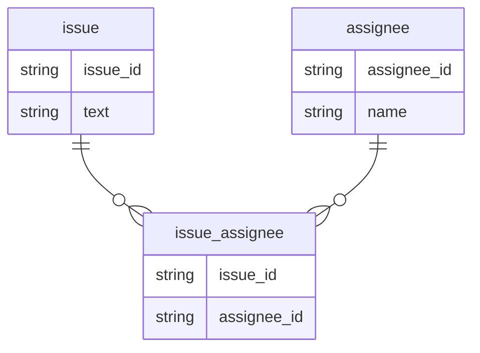

## 課題1

- SELECT NULL = 0; -> null 
- SELECT NULL = NULL; -> null  
- SELECT NULL <> NULL; -> null 
- SELECT NULL AND TRUE; -> null 
- SELECT NULL AND FALSE; -> false
- SELECT NULL OR TRUE; -> true
- SELECT NULL IS NULL; -> true
- SELECT NULL IS NOT NULL; -> false

※PostgreSQL環境で実行

## 課題2
### テーブル設計
- 中間テーブル（`issue_assignee`）を作成する

### NULLが存在することが悪であるか？
- 悪ではないと思うが、極力NULLが入らない設計にするべき（積極的に使うべきものではない）
- NULLが入る場合、正規化ができていない、責務が異なるデータが同一テーブルに入っていることを疑ってみる
- NULLが悪である理由
  - https://mickindex.sakura.ne.jp/database/db_getout_null.html

## 課題3
- デフォルトとして設定した値が意味を持っていた場合にバグを引き起こすため
  - NULLとそれ以外の値（空文字や0）は本来別の意味であり、別の意味として使用すべき

## 課題4
- SELECT NULL OR TRUE;の結果はTRUEである。ではSELECT NULL OR FALSE;の結果は？
- NULLを含む列でソートする場合、ORDER BY句で制御ができるか？制御できる方法は？