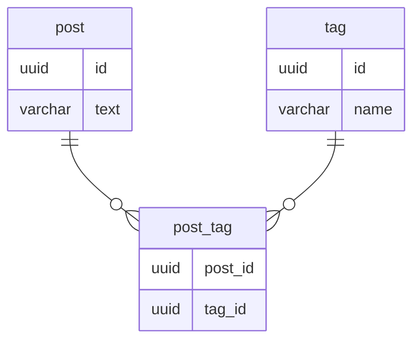

## 課題1
### カンマ区切りで複数の値を入れた場合、どのような問題が生じるか？
- 存在しないタグIDやID以外の値も自由に入れられてしまう
- 1つの投稿に対してタグの数の制限を設けたいなどの要求があった場合、DB側での制御が難しい
- 以下の場合のSQLが複雑になりコストがかかる
  - 取得処理
    - カンマで値を分割してその分joinする
  - 更新処理（タグA,B,C→B,C,D）
  - タグが削除された場合の処理
    - 各レコードにLIKE句?正規表現?を使って検索をかけにいき、ヒットしたレコードに更新をする
      - 正規表現や中間・後方一致の場合はインデックスが使えない
- （今回の課題対象外かもしれないが）カラムに入るデータ長に制限がかかってしまう

## 課題2

### ERD
- 多対多のテーブルを関連づける交差テーブルを設ける
  - データの妥当性や各処理の複雑化を抑えることができる

## 課題3
### サービス例を考える
- Slackのようなメッセージアプリ
  - チャンネルテーブルにusersを追加して、そこにチャンネルに存在する複数のユーザーIDを格納する