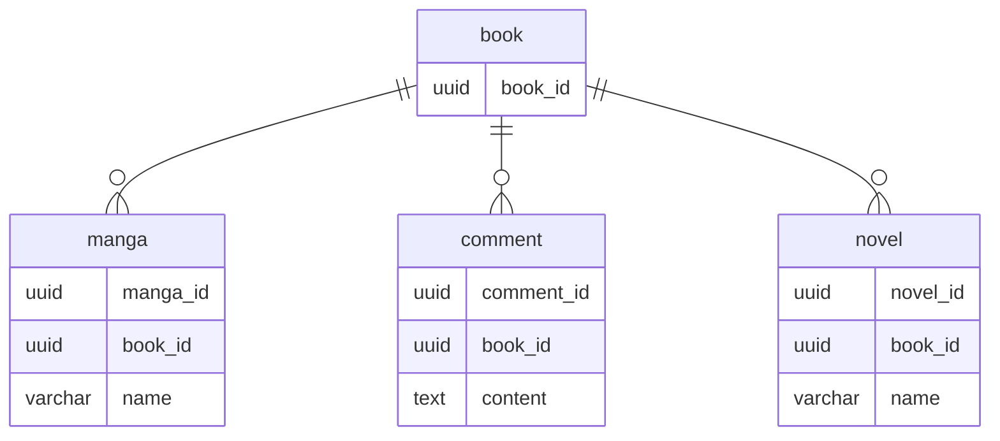

## 課題1
### どのような問題が生じるか？
- Manga と Novel に対して外部キー制約をかけられないので、整合性を担保できない
  - データの整合性をアプリケーション側でも検証する必要がある
- 取得時のSQLが複雑になる
  - 双方のテーブルから外部結合で取得する必要があり、実行結果に不要なNULLが入る
- typeの指定漏れする可能性があり、バグの原因となり得る

## 課題2

### ERD
- Manga と Novelの基底の親テーブル Book を設ける
- Book と Comment をシンプルな1対多の関係にすることで、上記で挙げた問題点を解消する

## 課題3
### サービス例を考える
- ECサイトで食品と生活用品というテーブルがあり、それぞれにレビューを関連づけたい
- レビューテーブルにtypeやidカラムが生まれるとアンチパターンに陥る