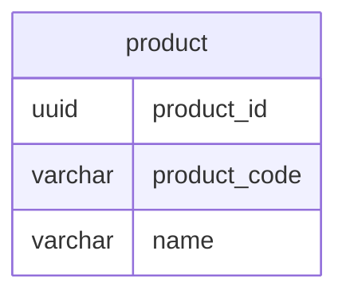

## 課題1
### どのような問題が生じるか？
- 業務変更などにより、将来的に商品コードが一意ではなくなる可能性がある
- 商品コードを変更する場合の影響範囲が大きい
  - テーブル内での一意性が担保されなくなる可能性がある
  - 商品テーブルを参照している別テーブルのデータも変更する必要がある
- つまり、、業務の変更に弱いテーブル設計である

## 課題2
- 主キーをproduct_id(サロゲートキー)にする
- サロゲートキーを採用することにより、以下を担保できる
  - 業務変更の影響を受けない＝不変であること
  - 一意であること

## 課題3
- 社員管理システムで社員idをPKとするときにアンチパターンに陥る