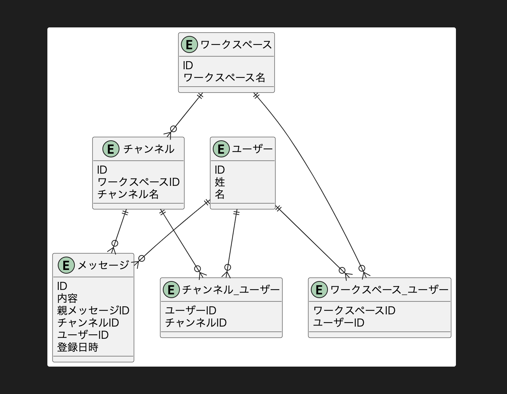

# DBモデリング2
## 課題1

- 各テーブルの作成日時や作成者カラムは省略
  - `messages`のみ誰が投稿したかの要件をクリアしていることを明示的に示すため記載
- `messages`
  - `parent_message_id`の有無でスレッド内のメッセージかを判断する
- `users_channels`
  - 拡張性を考慮するなら、action_typeのようなカラムを設けてEnumで定義すると良さそう（＋履歴も追えそう）
  - eg:
    1. join
    2. withdraw
    3. archive
    4. delete