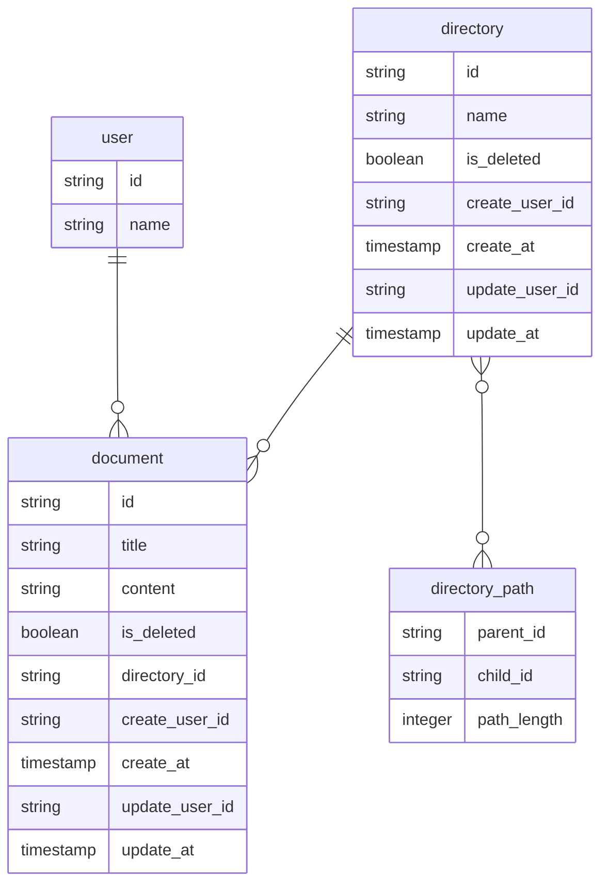
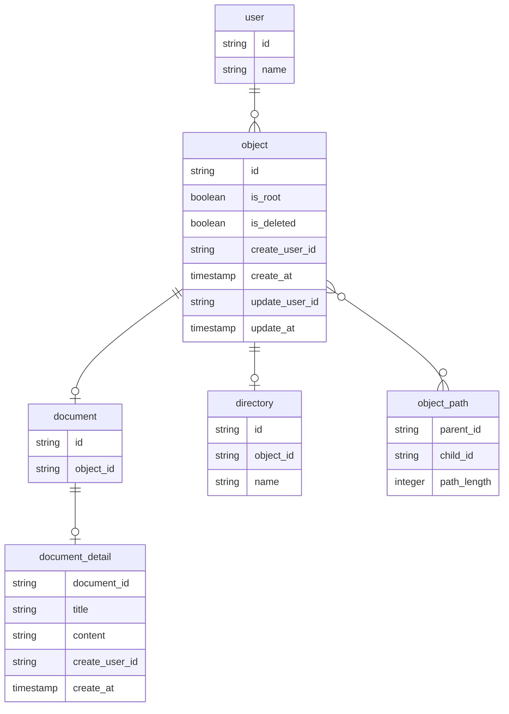

# DBモデリング3
## 課題1

### ※ボツ案です

- 閉包テーブル(`directory_path`)を採用し、全ての子孫パスとパス長を保存するように設計
- 隣接リストモデルを最初は考えたが、更新が楽である反面、取得がかなり辛そうなので採用せず

**上記では1ディレクトリ内にディレクトリとドキュメントがある場合の考慮が足りていないので考え直す**

#### 案1. documentとdirectoryを同じテーブルにする
flagもしくはtypeのようなカラムを設け、documentやdirectoryを判別するようにする
- メリット
  - 階層化の対象物として考えた時に冗長にならない
- デメリット
  - 共通にならない要素（ドキュメントの内容など）など、それぞれでしか使用されない無駄なカラムが生成される

 #### 案2. 上記のdirectoryテーブルに(parent_)directory_idを持たせる
ディレクトリ自身が属しているディレクトリ情報を持たせることで、documentテーブルと同じように閉包テーブルで各パス間を表現する
- メリット
  - 実体が異なるものを全く別のテーブルで管理できる（スッキリする？言語化が難しいので大したメリットではないと思う）
- デメリット
  - 閉包テーブルを表現するdirectory_pathに2テーブルのidが混在することになるため、複雑になる
 #### 案3. directoryとdocumentの1つ上の概念を持つテーブルを設ける
ディレクトリとドキュメントを共通のものとして扱う
- メリット
  - 無駄なリレーションがなく閉包テーブルでの表現が容易
- デメリット
  - 抽象的なテーブルになる（テーブルの命名も難しい...）

比較すると、案3の設計が一番綺麗で扱いやすい（致命的なデメリットもない）ので、案3を採用する

- 疑問
  - ルートフラグ（`is_root`）がないと、トップディレクトリ内の取得が難しい？
  - 閉包テーブル内のデータ量がネックとなりそうだが、解決策は？

参考
- [閉包テーブル](https://qiita.com/ymstshinichiro/items/b1825719c4fb274446cc)
- [RDBでツリー構造を実現する](https://www.wantedly.com/companies/autoro/post_articles/299434)

## 課題2
### ディレクトリ内のドキュメントの順番を変更できる
- objectテーブルに表示順カラムを設ける
  - 更新時は対象レコードにロックをかけるようにする
  - 更新時の処理が大変そうなため、他に良い方法がありそう