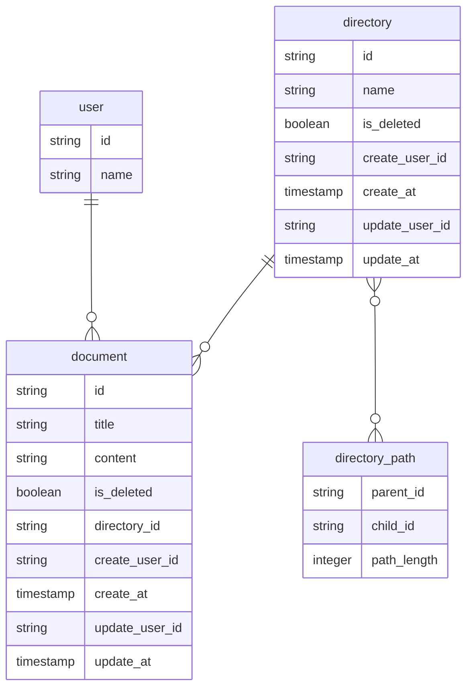

# DBモデリング3
## 課題1

- 閉包テーブル(`directory_path`)を採用し、全ての子孫パスとパス長を保存するように設計
- 隣接リストモデルを最初は考えたが、更新が楽である反面、取得がかなり辛そうなので採用せず

## 課題2
### ディレクトリ内のドキュメントの順番を変更できる
- documentテーブルに表示順カラムを設ける
  - 更新時は対象レコードにロックをかけるようにする
  - 更新時の処理が大変そうなため、他に良い方法がありそう