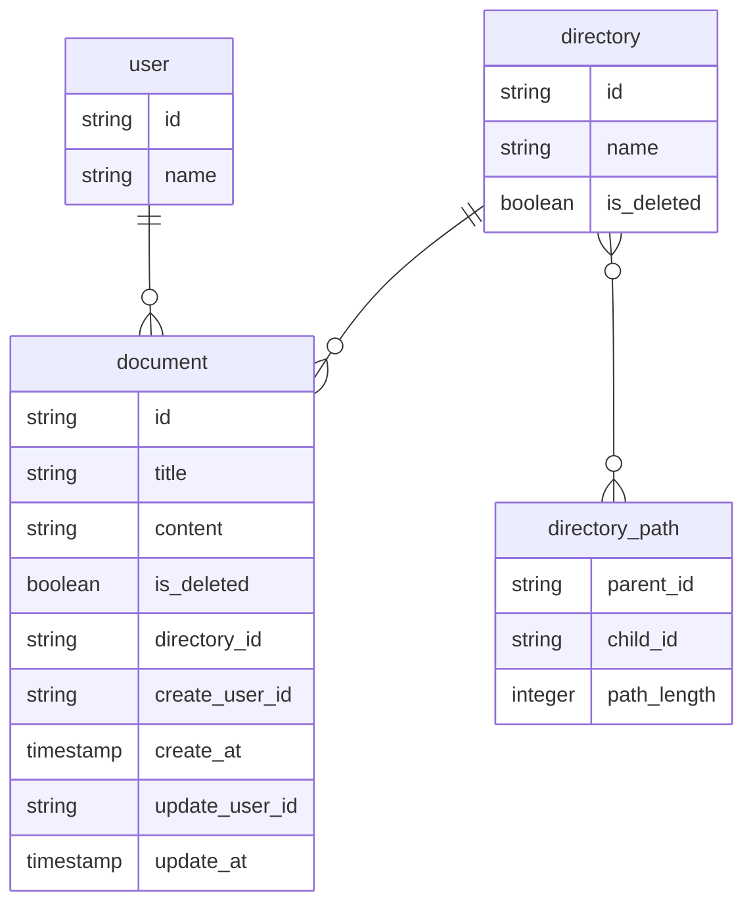

# DBモデリング3
## 課題1

```mermaid
erDiagram
user ||--o{ document: ""
directory ||--o{ document: ""
directory }o--o{ directory_path: ""

user {
  string id
  string name
}

document {
  string id
  string title
  string content
  boolean is_deleted
  string directory_id
  string create_user_id
  timestamp create_at
  string update_user_id
  timestamp update_at
}

directory {
  string id
  string name
  boolean is_deleted
}

directory_path {
  string parent_id
  string child_id
  integer path_length
}

```

## 課題2
### ディレクトリ内のドキュメントの順番を変更できる
- 閉包テーブル(`directory_path`)に全て子孫パスとパス長を保存する

- 他に考えたけどボツになったこと
  - 一つ前の順にあるドキュメントIDを保持する(隣接リストモデル)
    - 更新は楽だが、取得が辛い