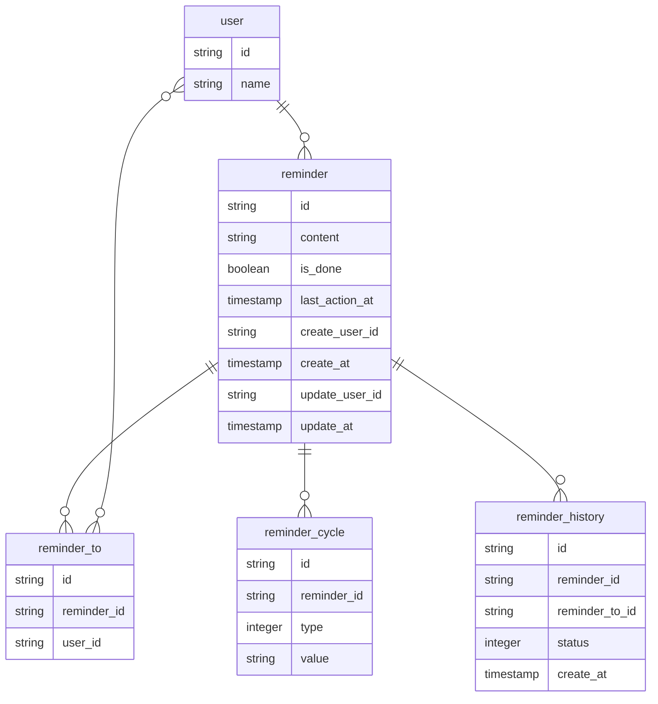

# DBモデリング4
## 課題1

### 補足
- リマインダー(`reminder`)テーブル
  - リマインド内容と完了しているかを管理する
    - 完了ステータスはbooleanではなくintegerにして複数ステータスを持てるようにしても良いかもしれない(eg: 保留/スヌーズなど)
- リマインド先(`reminder_to`)テーブル
  - リマインド先のuserを管理する
  - 1つのリマインドは複数のuserに紐付ける
- 頻度(`reminder_cycle`)テーブル
  - `type`で毎週/毎日/毎月/x日おきを管理する
  - `value`でx曜日/x日を管理する
  - 別テーブルにしている理由: 将来的に頻度:カスタムが採用された場合、複数の頻度を組み合わせた頻度に対応できるようにするため
  - 終了日や繰り返しx回などの機能拡張時もこのテーブルにカラムが増えるイメージ

- バッチ実行時のイメージ
  - 完了していないリマインドの頻度とリマインド履歴を計算し、リマインダーを実行する

### 疑問
- Enum（今回でいう`cycle`）はDB側orプログラム側でどちらで値を持つべきか？