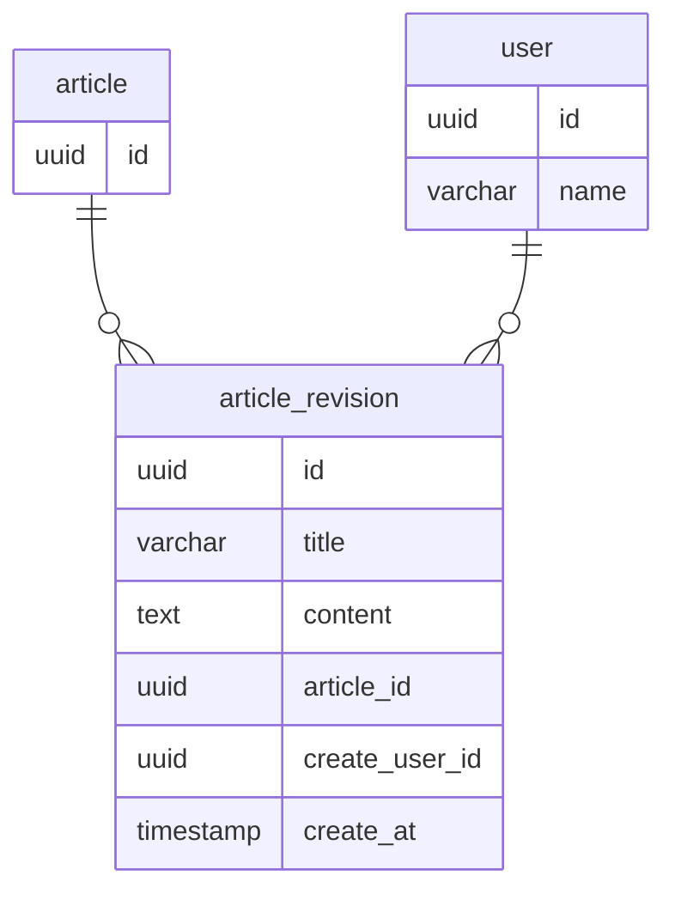
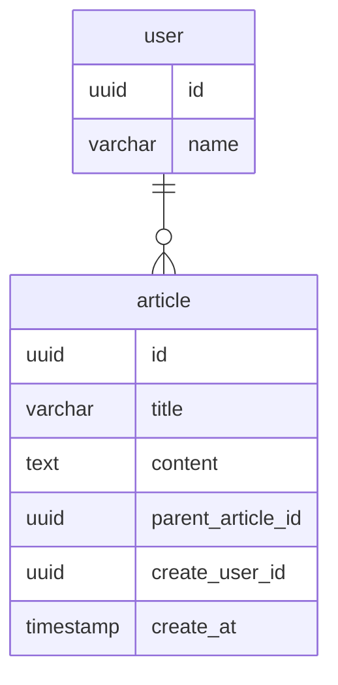

# DBモデリング5（ドキュメント管理システム）
## 課題1

### ERD

### テーブルの説明
- ユーザー(`user`)テーブル
  - ユーザーを管理する
- 記事(`article`)テーブル
  - 記事を管理する
  - 現状idしかカラムがないが、記事の状態なども持つことも考えられる
- 記事リビジョン(`article_revision`)テーブル
  - 各記事毎に履歴（その時点でのタイトルや内容）を管理する
  - 記事を更新する度にINSERTされる
    - 更新された時点でのバージョンが保存されるイメージ

### 設計の背景
- 今回は記事毎の履歴を管理したいという要求があるので、同一テーブルのカラムをUPDATEする形では実現できないと判断、そのため記事と記事の内容を保存するテーブルを分けた

### 補足
- 記事毎の履歴を閲覧したい
  - 記事リビジョンテーブルに対し、記事IDで検索をする
- 履歴を選択して過去の記事状態に戻したい
  - 記事リビジョンテーブルにINSERTする
  - ある状態から過去の状態に戻したという履歴を残したいため、この場合でも新たに更新をした（＝リビジョンを積む）扱いとする
- 最新状態の記事一覧を表示したい
  - 記事リビジョンテーブルに対し、記事ID毎に作成日時が最新であるデータを集計する
- 記事を削除したい
  - 記事及び記事リビジョンのデータを物理削除する

## 課題2
### 分析の用途のみでDBに保存しておく必要があるか？
- （以前のメンターセッションでも話があったが）分析用途のみであれば、商用DBにデータを持っておく必要はなさそう
  - BigQueryなどのデータウェアハウスに持っておく？

### 他の設計方法で考えてみる
#### 1つのテーブルで再現するERD

#### テーブルの説明
- 記事の初稿時は`parent_article_id`が`null`になる
- 記事の更新時は`article`に1件レコードをinsertする
  - `parent_article_id`に更新元（初稿）の記事IDを入れる
    - JOINする回数が不明確になるため、初稿の記事IDを入れるようにする

#### 考察
- メリット
  - 記事に関するテーブルが1つになる(?)
- デメリット
  - 記事とその履歴を管理するテーブルが分かれており、1つのテーブルに責務を持ちすぎている
    - そのため、更新や削除時の処理が複雑になる
- 結論
  - デメリットが大きい。責務分割の観点でもやはりテーブルは分けるべき。