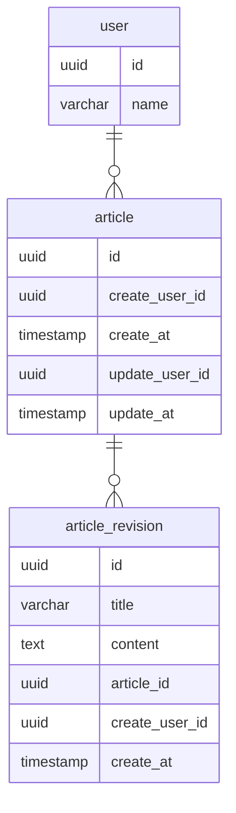

# DBモデリング5（ドキュメント管理システム）
## 課題1

### ERD

### テーブルの説明
- ユーザー(`user`)テーブル
  - ユーザーを管理する
- 記事(`article`)テーブル
  - 記事を管理する
- 記事リビジョン(`article_revision`)テーブル
  - 各記事毎に履歴（その時点でのタイトルや内容）を管理する
  - 記事を更新する度にINSERTされる
    - 更新された時点でのバージョンが保存されるイメージ

### 補足
- 記事毎の履歴を閲覧したい
  - 記事リビジョンテーブルに対し、記事IDで検索をする
- 履歴を選択して過去の記事状態に戻したい
  - 記事リビジョンテーブルにINSERTする
  - ある状態から過去の状態に戻したという履歴を残したいため、この場合でも新たに更新をした（＝リビジョンを積む）扱いとする
- 最新状態の記事一覧を表示したい
  - 記事リビジョンテーブルに対し、記事ID毎に作成日時が最新であるデータを集計する
- 記事を削除したい
  - 記事及び記事リビジョンのデータを物理削除する

## 課題2
