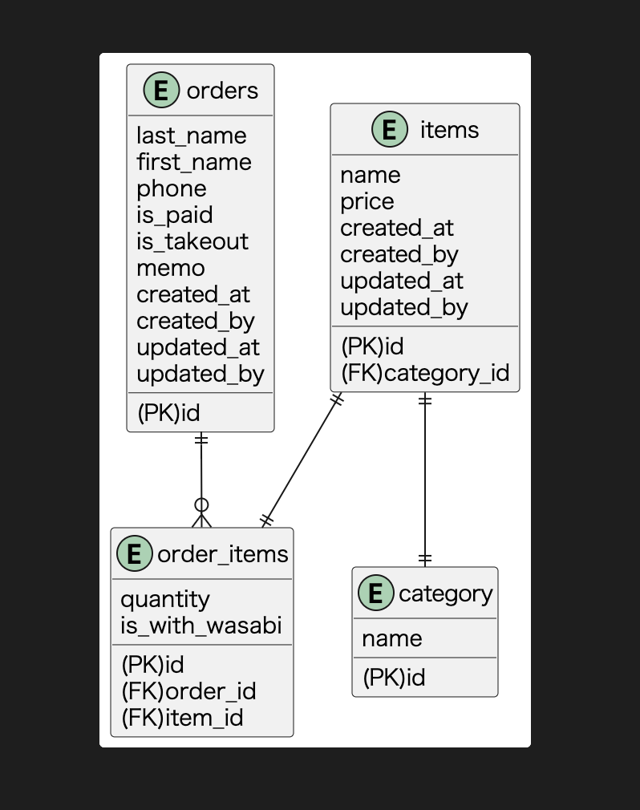

# DBモデリング1
## 課題1

- 店員のテーブルは省略
  - created_byとupdated_byには店員idが入る想定

### 論理モデルと物理モデルの違い
- 論理モデル
  - 概念モデルを基にER図上の情報
  - データ構造を決める
  - テーブル名やカラム名は日本語で良い
- 物理モデル
  - 論理モデルをより詳細化し、実際のDBと1:1になる
  - DBへの実装を目的としたものである
- まとめ
  - 概念モデルで「どういうデータが必要か」を整理する
  - 論理モデルで「それらのデータはどういう関係になるのか」を考える
  - 物理モデルで「じゃあそれをDBに実装するとどうなるか」を表現する

## 課題2
### 問1
- `orders_item`に`size`を追加する
  - `is_large`などとしてしまうと、将来的に「大中小」にしたい等の要求に応えられなくなるため、Enumで定義する

### 問2
- 既存データへの影響(マイグレーション)をなるべく小さくするためマスター側の改修を行う
- `set_items`テーブルを作成する
  - セット商品(親)となる`parent_item_id`とそれに含まれる寿司ネタ(子)となる`chile_item_id`とその子の個数`quantity`を持たせる
- 集計時は、`items`と`set_items`を外部結合して算出する

## 課題3
- 自分が考えた仕様変更: 顧客が会員登録済みかを判定し、会員の場合は会計が5%オフになる

- yanoさんの仕様: キャンペーンを開催するので、期間限定で特定の寿司ネタの金額を変更する
  - items_campaignのような以下の構造のテーブルを作成する
    - アイテムID, 金額, 開始日, 終了日  ...その他省略
  - 注文日が開始日と終了日の間（＝キャンペーン期間中）は、商品単価をitems_campaignが引っ張ってくる
  - ※itemsのpriceを変更するのはリスクが大きそうだからやめたほうが良さそうと考えました