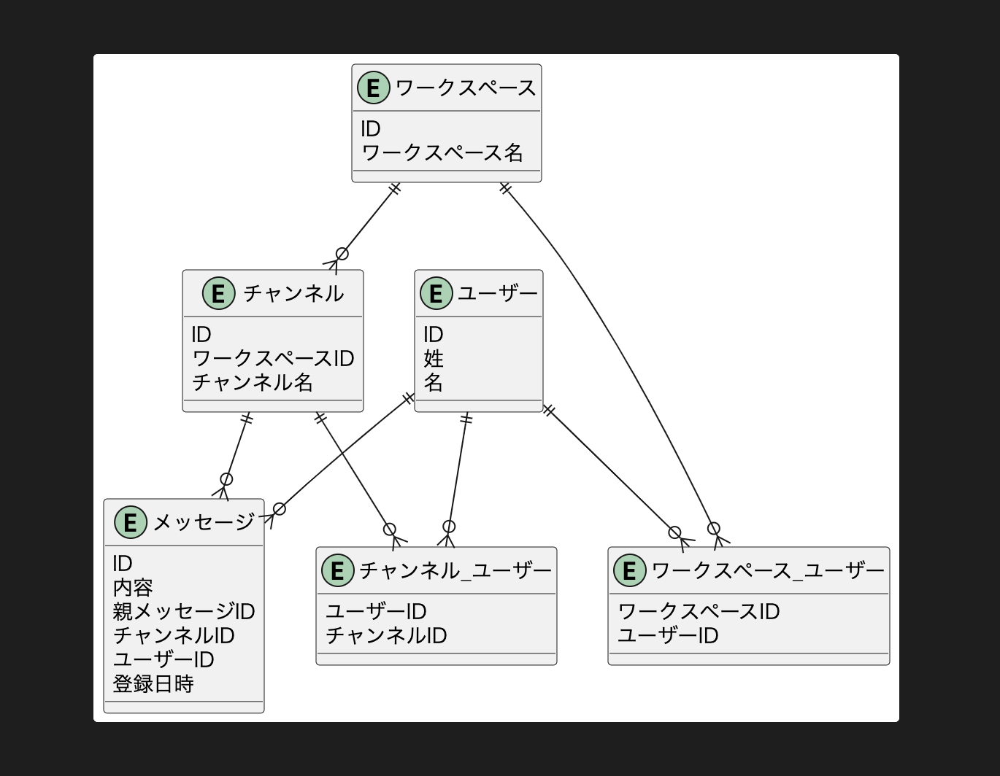

# DBモデリング2
## 課題1

- 各テーブルの作成日時や作成者カラムは省略
  - `メッセージ`のみ誰が投稿したかの要件をクリアしていることを明示的に示すため記載
- `メッセージ`
  - `親メッセージID`の有無でスレッド内のメッセージかを判断する
- `ユーザーチャンネル`
  - 拡張性を考慮するなら、action_typeのようなカラムを設けてEnumで定義するのもありかも（＋履歴も追えそう）
  - eg:
    1. join
    2. withdraw
    3. archive
    4. delete