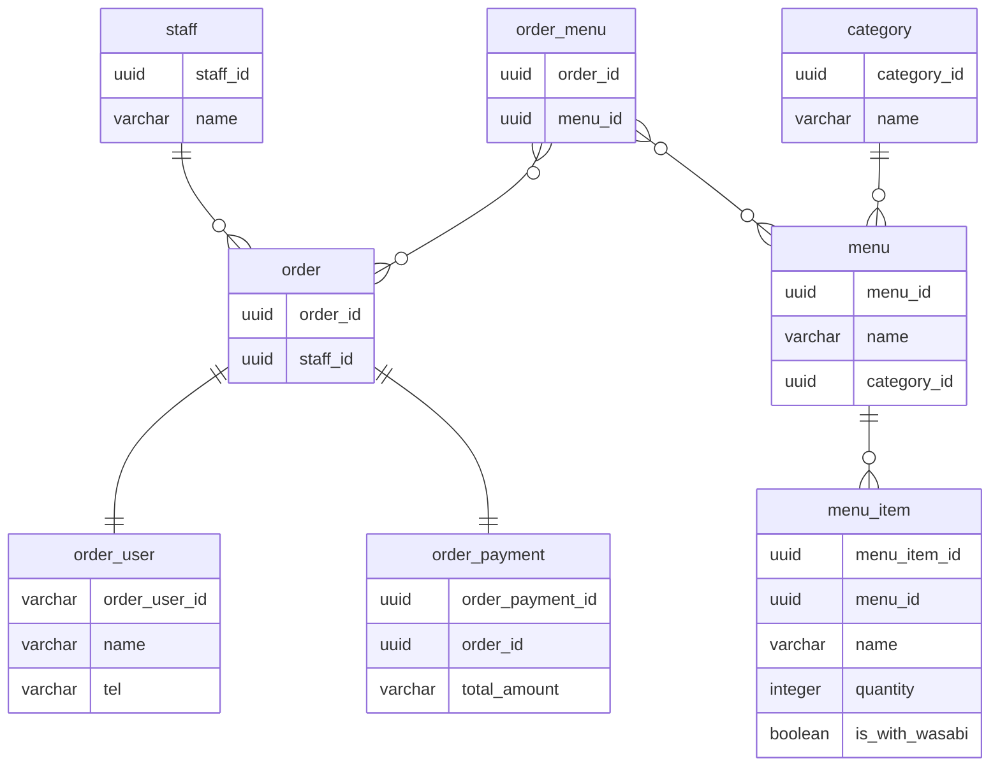
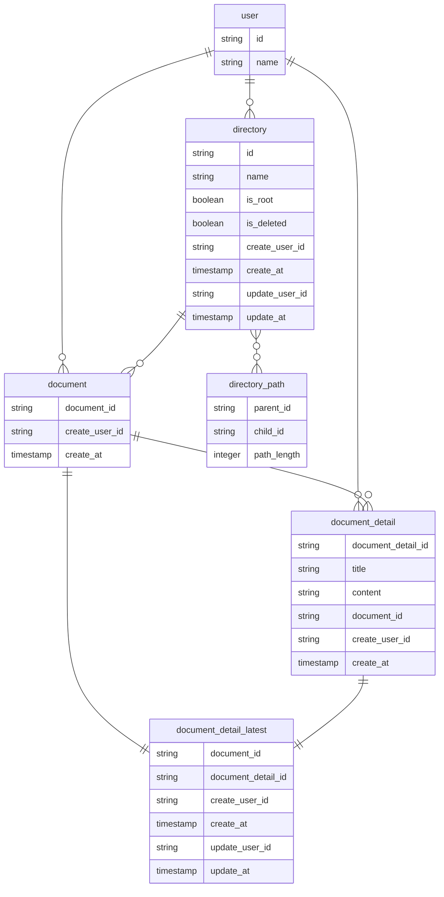
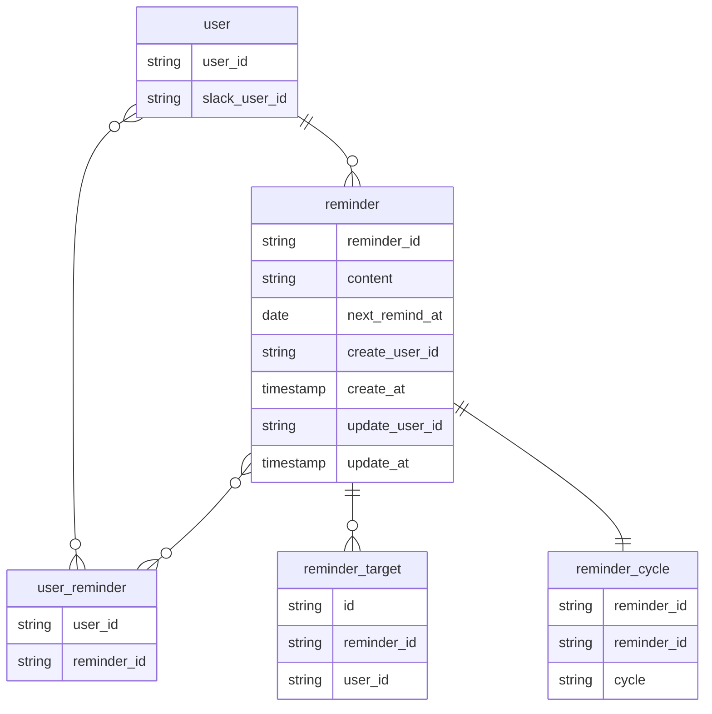
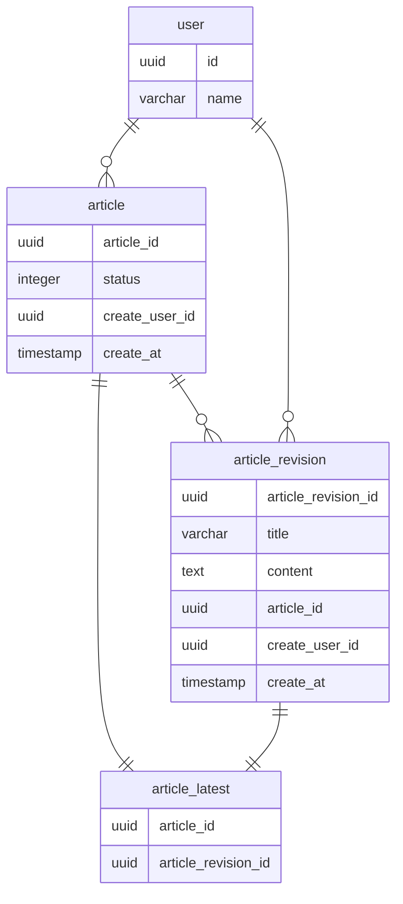

## DBモデリング1（注文表）
- 元の回答: https://github.com/nyuusen/praha-challenge/tree/main/db-modeling/db-modeling-1
- `order`を注文者/支払い/注文内容でテーブルを分割
- `menu`という基底クラスを作り、`menu_item`という子テーブルを作ることで、セットメニュー内でA商品はわさび入り、B商品はわさび抜きなどを表現できるように修正

## DBモデリング2（Slack）
- 変更なし([参考](https://github.com/nyuusen/praha-challenge/tree/main/db-modeling/db-modeling-2))

## DBモデリング3（ドキュメント）
- 元の回答: https://github.com/nyuusen/praha-challenge/tree/main/db-modeling/db-modeling-3
- 「ドキュメントは必ず何らかのディレクトリに属する」という仕様を網羅できていなかったため、`object`という基底クラスを削除
- 閉包テーブルを採用する大枠の設計方針は変更なし
- 最新記事情報を格納する中間テーブル(`document_detail_latest`)を追加
  - これまではsubquery内でウィンドウ関数を用いることで最新記事を取得する方向で考えていたため中間テーブルを作っていなかったが、最新記事を取得するクエリは使用頻度が高いため中間テーブルを作成した
  - あえて中間テーブルを作成した理由は、問題のある副作用(`update`)が発生した場合に影響範囲を小さく抑えるため

## DBモデリング4(リマインダー)
- 元の回答: https://github.com/nyuusen/praha-challenge/tree/main/db-modeling/db-modeling-4
- 履歴テーブル(`reminder_history`)を削除
  - 履歴を追いたいユースケースが考えられなかったため
- 頻度は`reminder_cycle`にcron形式で格納し、実行時に`next_remind_at`を更新していく
- 1時間ごとのバッチ処理で`next_remind_at`の値が1時間以内のものを抽出し、実行する
- リマインド実行時は、`user_reminder`に宛先ごとにinsertする
  - 完了ボタンが押されたらdeleteする

## 課題5（編集履歴を保存できるブログサービス）
- 元の回答: https://github.com/nyuusen/praha-challenge/tree/main/db-modeling/db-modeling-5
- DBモデリング3と同じ理由で最新記事テーブルを追加

