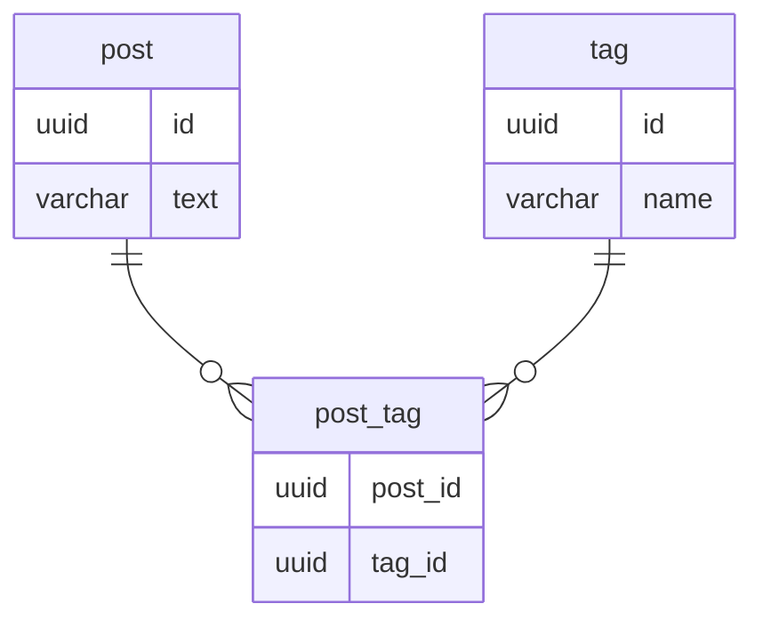

## 課題1
### どのような問題が生じるか？
- タグが増減する度にテーブル設計を修正する必要がある
  - アプリケーション側の修正も必要になる
- タグが極端に増えた場合、カラム数がかなり増えてしまう
- 取得時にタグ数分だけ結合が必要となり、SQLが複雑&パフォーマンス懸念が生じる

## 課題2

### ERD
- （問題1と同じ回答ですが）多対多のテーブルを関連づける交差テーブルを設ける
  - データの妥当性や各処理の複雑化を抑えることができる

## 課題3
### サービス例を考える
- 何らかの申請に対して承認を行うことができる仕組みで、当初は承認者が1人だったが、仕様変更により承認者が複数人設定できるようになった場合、承認者IDを増やした時にアンチパターンに陥る