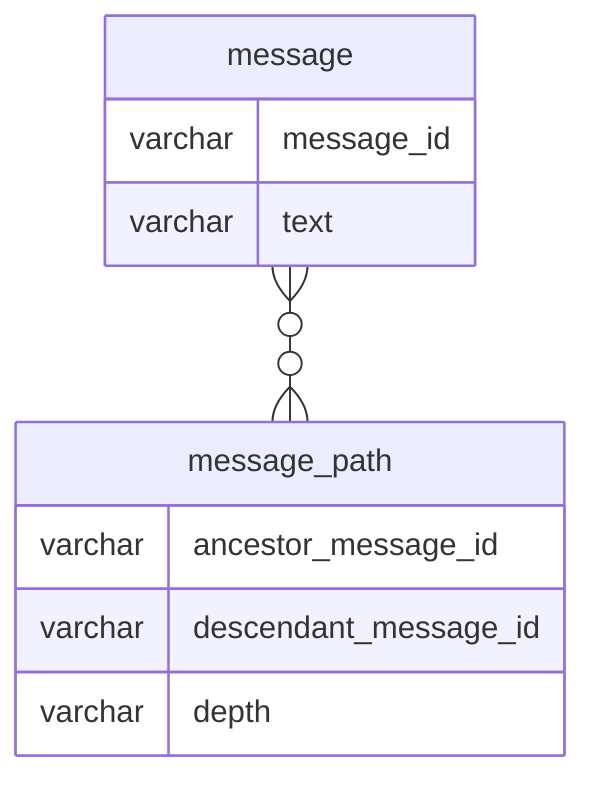

## 課題1
### どのような問題が生じるか？
- 全階層を取得するSQL発行が難しい
  - 階層数分だけJOINをする必要があるため、事前に階層数を知っておかないとSQL発行ができない
  - 全てのデータを取得してからアプリケーション側で階層構造を構築することもできるが、複雑な処理が必要なのでパフォーマンス懸念がある（頻繁に呼ばれる処理なので）
- 取得した結果が階層数分だけ列が増えるので、集約関数での扱いやアプリケーション側でのデータ扱いも難しい
- 1回のクエリで自身とその1階層上のしか取得できないため、ノード削除時のクエリが複雑になり
  - 加えて、自動昇格ができないので、削除後に複数回クエリを発行し、親idを変更する必要がある

（tweetです..）
- Slackを想定するのであれば、階層数は「2」で固定なので、今回の設計でも問題ないのではと思った
  - ドキュメント管理システムのような階層数が無限にある階層構造であれば、課題2のような設計手法が有用

## 課題2

### ERD
- （階層構造が無限のアプリケーションを仮定し）以下の理由から Closure Tableを採用する
  - 取得SQLが簡単
    - 特定の特定のノード配下のノードを取得するのが容易
    `SELECT * FROM messages AS M INNER JOIN message_path AS MP ON M.message_id = MP.descendant_message_id WHERE MP.ancestor_message_id = {検索したいid}`
    - 特定のノードへの挿入、ノードの削除が容易

## 課題3
### サービス例を考える
- Googleドライブのような階層構造があるアプリケーションで、各ファイルやフォルダの階層構造を自身の親idを格納する形に設計した場合にアンチパターンに陥る