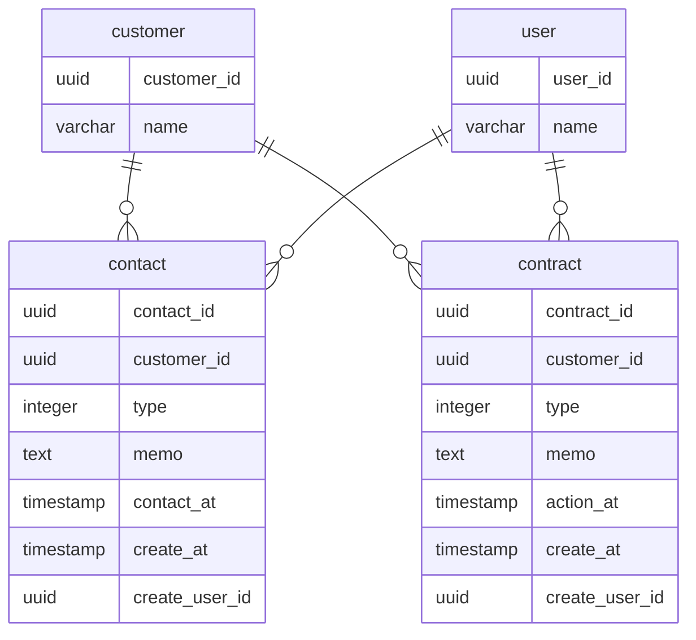

## 課題1
### どのような問題が生じるか？
- 商談や電話の数や過去の履歴などの詳細な情報を管理できない
  - 商談を3回実施した場合、1回目の実施日時やメモの閲覧ができない
- 商談/電話/成約以外の状態を管理したい要求が発生した場合、既存テーブルにマイグレーションをする必要がある
  - 例えば解約や年末挨拶したかなど
- 誰が商談したか/電話したかを記録できない
- 1レコードに対して頻繁にUPDATEが行われる
  - 意図しないレコードへの更新をしてしまうバグの起因になる

## 課題2

- 設計概要
  - 顧客情報は`customer`テーブルに保存する
    - 顧客名や住所などの顧客Entityの情報を持つ
  - 社員情報は`user`テーブルに保存する
  - 電話や商談した情報は`contact`テーブルに保存する
    - `type`により電話/商談を区別する
    - 電話も商談も「顧客との接点」という意味では同じものと捉えた
      - 管理する情報としては「誰が」「いつ」「何を話したか」と共通するものが多い
  - 契約情報は`contract`テーブルに保存する
    - 契約情報は、顧客や接点という情報とはまた属性が異なるものだと思うので別テーブルに切り出した
    - `type`により契約/休会/解約を区別する
    - 契約や解約する度にinsertをする

- メリット/デメリット
  - メリット
    - 過去の電話や商談を記録・閲覧できる
    - 商談や電話以外のケースが発生した場合、テーブル追加のみで対応できる（既存テーブルへのマイグレーションは発生しない）
    - 基本的にはinsertのみのため、意図しないレコードへの更新を気にする必要がなくなる
  - デメリット
    - 「商談と電話」及び「契約と解約（と休会）」が同じテーブルで管理されているため、取得時にtypeを指定する必要がある
    - データ量が多くなりそう..

## その他（議論したいこと）
- 顧客との商談・電話情報は履歴として閲覧したい要求があると思い、物理削除は想定していないが、どうか？
- 商談と電話を「顧客との接点」として同一テーブル`contact`としたが、どうか？