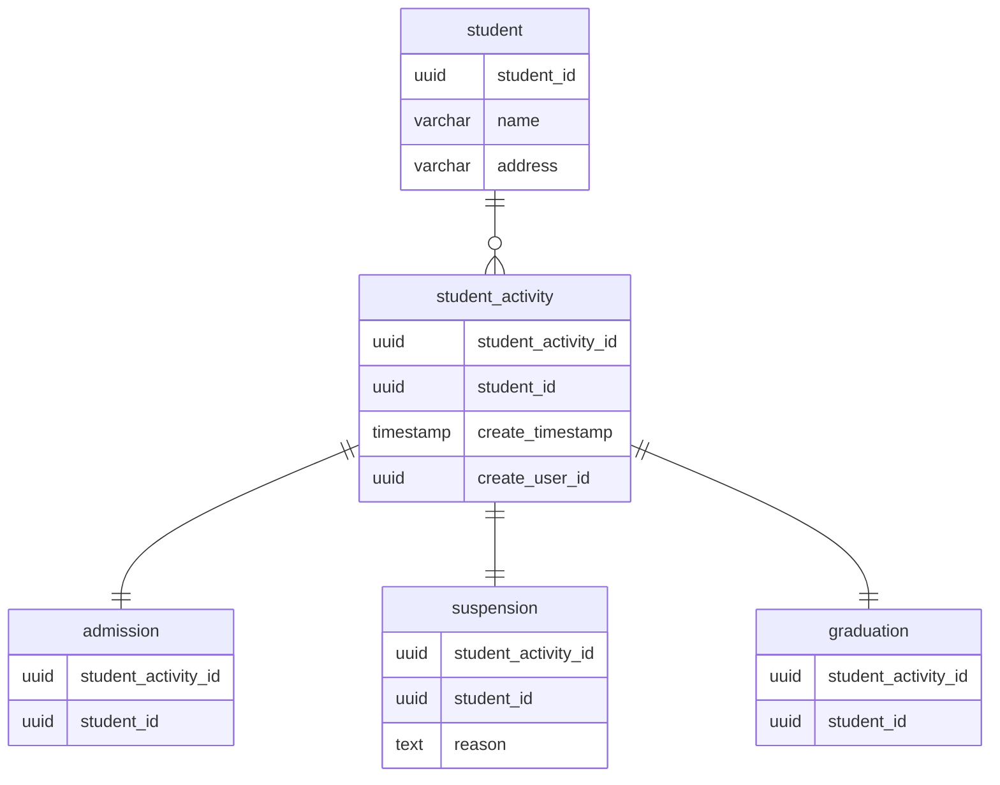

## 課題1
### どのような問題が生じるか？
- （省略されているだけかもしれないが）いつ、どのような理由で停学したのかなど各イベントごとの情報の管理が難しい
  - 仮に1つのテーブルに各イベント固有の情報を持たせる場合、nullableなカラムが増えてしまう
- 以前のステータス及びその詳細（いつ入学したか/停学歴はあるか等）を取得できない
- 1レコードが更新される設計のため、システム設計が複雑になる
  - 例として「在学中ではない学生が卒業状態になってはいけない」等の更新に伴う制約を設ける必要がある
  - 複雑化はバグを生む要因になる
- 生徒のステータスが増えた場合、既存テーブルへのマイグレーションの必要がある
  - 既存テーブルへのマイグレーションもバグを生む要因になり得るため
  - アプリケーション側の修正も必要になる

## 課題2
### ER図

### 設計概要
  - `student`という「リソース」と卒業などの「イベント」を別のエンティティとして考え、 `student`という生徒という実体と、それ以外のイベントという形でテーブルを分割した
    - 理由1: updateを少なくしinsertオンリーなシンプルな設計にすることで、バグ発生要因をできるだけ排除するため
    - 理由2: いつ入学したかなどの各イベントの詳細や履歴を追えるようにするため
  - 入学や卒業などイベント発生した場合は、`student_activity`テーブルに各イベント共通の日時などの情報が格納される＋`admission`(入学)等にイベント毎の詳細情報が格納される

### 各テーブルの説明
  - `student`テーブル
    - 生徒自体のエンティティを管理するテーブル
    - 名前や住所などが格納される
  - `student_activity`テーブル
    - 生徒の入学や停学、卒業など各イベントのスーパータイプの役割をするテーブル
    - イベント発生日時などが格納される
  - `admission`,`suspension`,`graduation`
    - 入学/停学/卒業イベント固有の情報を管理するテーブル
    - 各イベント固有で保存したい情報があまり浮かばず。。
    - サロゲートを用いて操作するユースケースがないと思うので、PKは`student_activity_id`としている
    - 停学歴のある生徒を調べたユースケースを考え、`student_id `を設けた
      - なくても取得できるが、 `student_activity`を経由してjoinする必要があるので、このテーブルに持たせてしまった方が容易と感じた

## 課題3
- 物流管理システム
  - 商品の受付、出荷、発送、搬入を1つのテーブルで管理しようとしたときにアンチパターンに陥る

## その他（トリオSで議論したいこと）
- 既存テーブルへの変更はなるべくしない方が良いと思ってますが、その理由を少しふかぼりたいです。また、皆さんの意見や実務現場での方針を聞いてみたいです。
  - 既存テーブルへの変更がNGな理由
    - 変更に工数がかかる
    - アプリ側とDB側で定義にズレが生じた場合にバグになる
- 各イベント固有で管理したい情報がない場合は基底クラス（スーパータイプ）を設けなくても良さそう..？