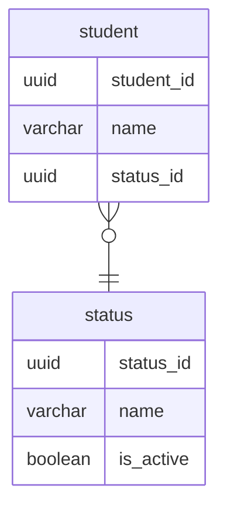

## 課題1
### どのような問題が生じるか？
- 取りうるstatusの取得が困難
  - 以下のSQLで取得できるが、テーブルに存在しないstatusは取得できない
  ```
  SELECT DISTINCT status FROM student;
  ```
  - メタデータ取得のためのビューを使うこともできるが、アプリケーション側での取得は難しいので、画面側にステータス一覧のような値を返すことが難しい
- statusを削除、更新したい時に変更にコストがかかる

## 課題2
### ER図


- statusテーブルに全statusを定義して、studentテーブルにstatus_idを持ち外部キー制約を使用する
## 課題3
- 物流管理システム
  - 商品の受付、出荷、発送、搬入を1つのテーブルで管理しようとしたときにアンチパターンに陥る
