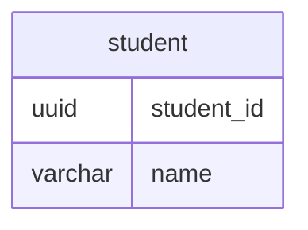
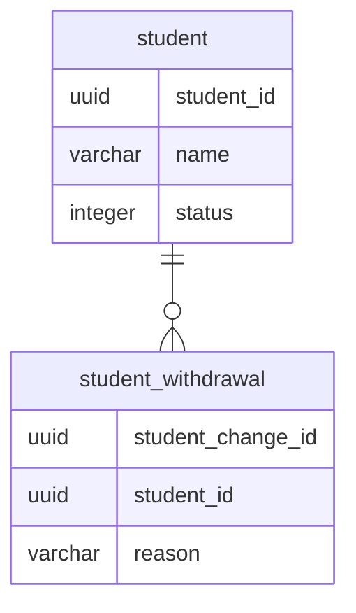

## 課題1
### どのような問題が生じるか？
-  どんなクエリでも検索条件にflagが必要になる
   - 忘れた場合はバグの原因となる
   - コードの見通しも悪くなる
- データ不整合が発生する可能性がある
  - 物理削除を行わないため、`CASCADE`などを用いた外部キー制約ができない
- 不要なデータがテーブル内に残ってしまう
  - 増えすぎると処理速度などのパフォーマンス劣化に繋がる
- 退会以外のステータスを持たせたい場合にカラム追加する必要がある
  - 例えば`休会`や`強制退会`など

## 課題2

仕様と要求により、設計を変更する。

**1. 退会したユーザーは物理削除をする**
- 退会したユーザーを残す/トレースする必要がない場合は、studentテーブルからflagを削除し、退会時は物理削除を行う
- メリット
  - クエリのWHERE句にflagを入れなくて良い
  - 不要なデータが残らない
- デメリット
  - 退会を取り消すことができない
    - 例えば退会後に再度入会した場合を復会として扱えない

**2. 退会をイベントとして別テーブルで管理する**
- 退会したユーザーを管理したいユースケースを想定すると、退会以外のステータスのユーザーも厳密に管理したいアプリケーションと推測する
- その場合、ユーザーの変更や退会をイベントとして、イミュータブルデータモデルを採用する
- メリット
  - 各イベントごとのデータを管理することができる
    - 退会以外のステータスを持たせたい場合にもテーブルを追加するだけで良くなる
  - いつ退会して、いつ再度入会して、というような詳細の履歴を追うことができる
    - この履歴を追いたい要求があるアプリケーションである必要であるが。。
  - イベントごとに管理したい情報（例:退会理由）を持つことができる　
- デメリット
  - 課題1で出た「どんなクエリでも検索条件にflagが必要になる」という問題は解消されない

- 他に考えたこと
  - 退会ユーザーを別テーブルに移動する
    - studentテーブルには有効なユーザーしか存在しないため、WHERE句でflagを検索する必要はなくなるが、studentテーブルが外部キーの関係を持つテーブルも移動させる必要がありそう？
    - この辺りの設計や運用が難しそうだと感じた
  - アンチパターン6のようにステータステーブルを別に持たせる
    - 当初問題だった退会以外のステータス管理ができないという問題は解消される
    - ただ以前のステータスや退会理由などの情報を管理することができない（＝管理するとしたらテーブル追加する？）と感じた

## 課題3
- ECサイトでの例
  - 取り消された注文の情報が完全に消えてしまうので、どのような商品のどのユーザーがしたというような注文の詳細を追うことができない
    - 例えば、データが削除される＝画面の表示もなくなるので、思わぬバグやクレームなどが発生する要因となる
  - ユーザー側から依頼があったとしても調査を行うことができない
- 学習の進捗管理サービスでの例
  - 再入会した場合は、全て新規ユーザーとして扱う事になる
    - 誤操作で退会した場合など、記録してきた進捗が見えなくなる
  - 退会済みユーザーを含めた分析等ができない
- 過去に物理削除を採用したケースがない。。