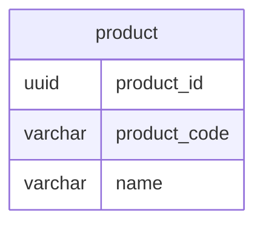

## 課題1
### どのような問題が生じるか？
- 後から商品コードを変更したいという要求が出た場合、テーブル全体（一意性の担保）及び他のテーブル（FKとして参照しているテーブル）に影響が及ぶ

## 課題2
- 主キーをproduct_id(サロゲートキー)にする
- サロゲートキーを採用することにより、以下を担保できる
  - 業務変更の影響を受けない＝不変であること
  - 一意であること

## 課題3
- 社員管理システムで社員idをPKとするときにアンチパターンに陥る